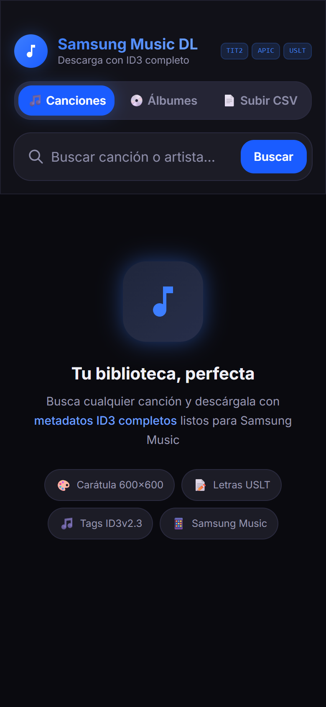
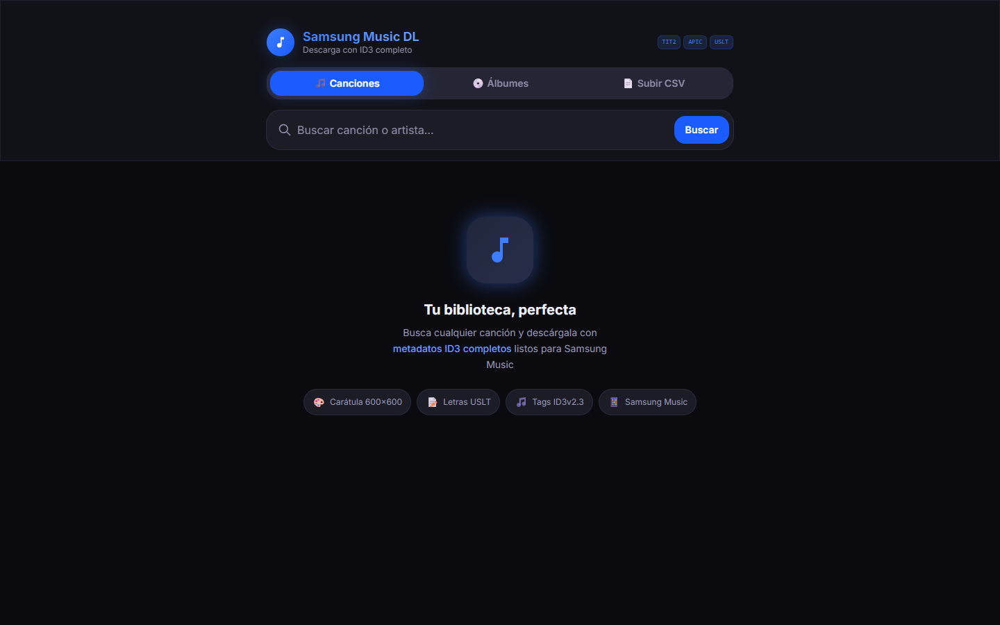
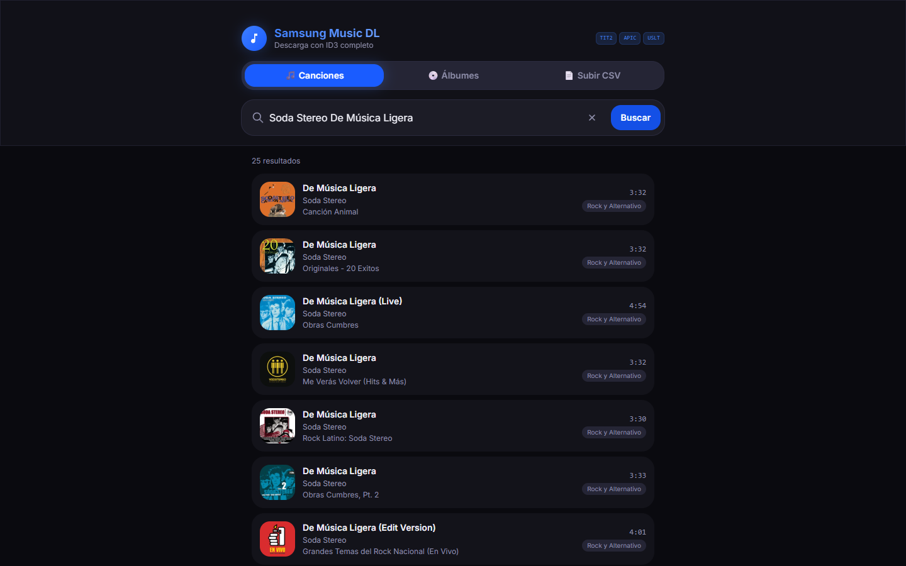
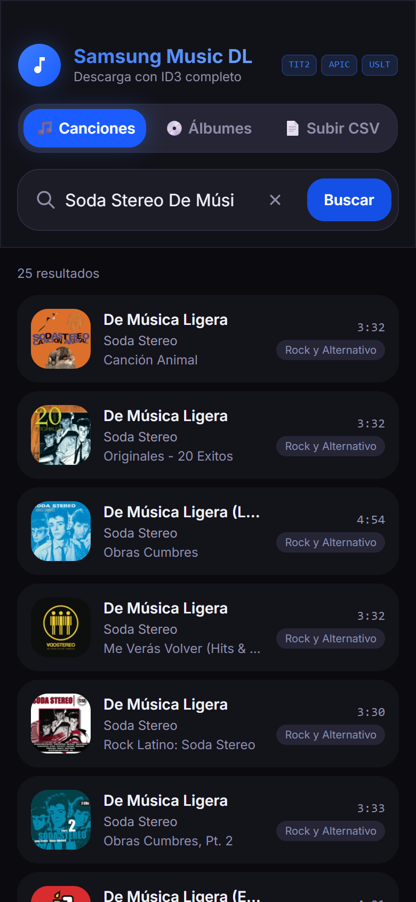
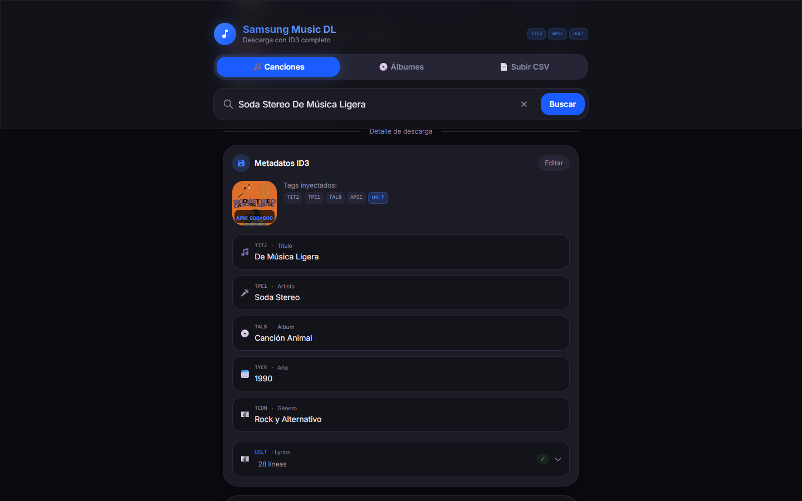
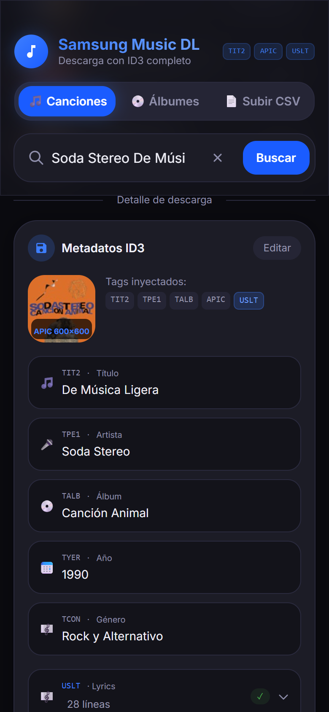
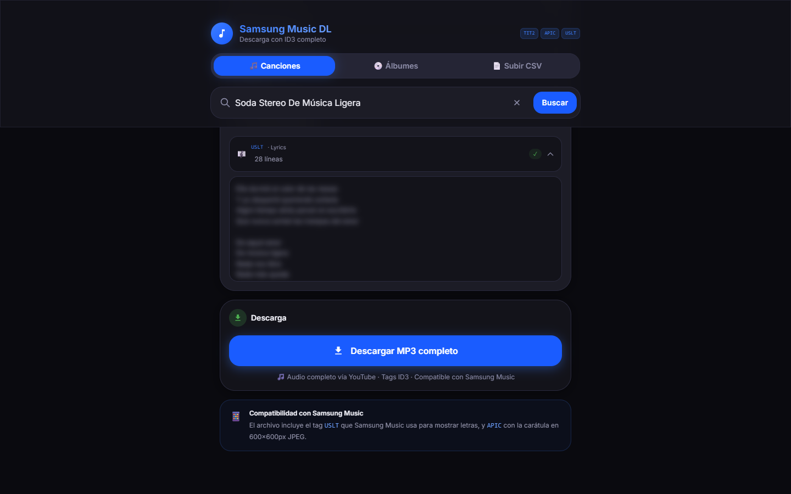
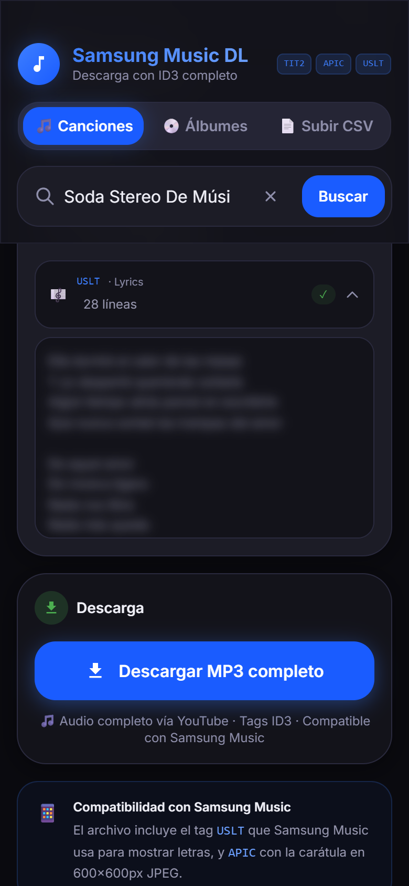
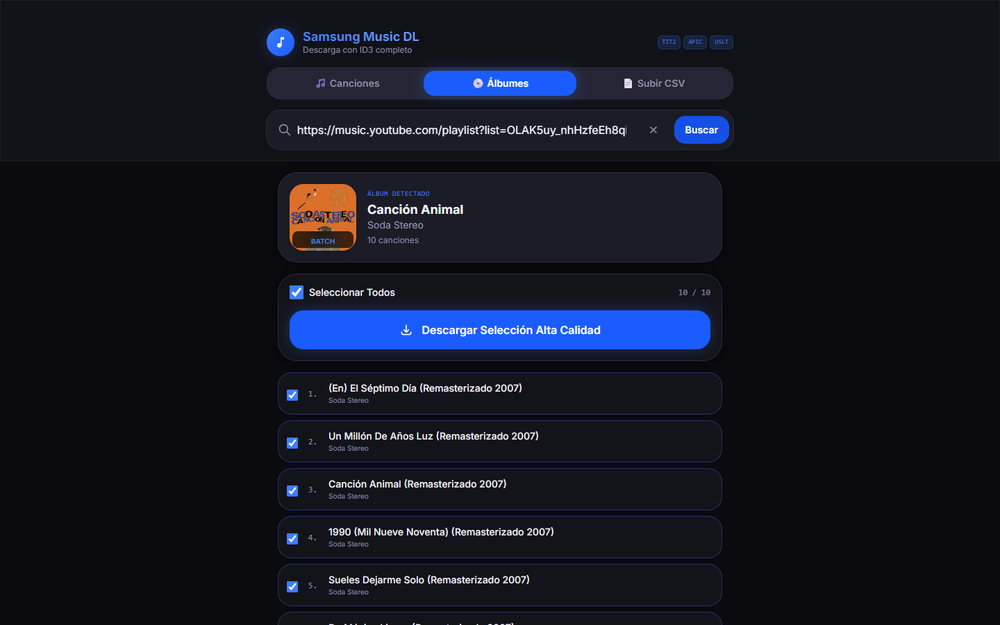
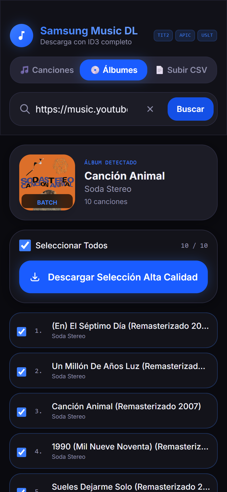

# Samsung Music DL

PWA hecha con Next.js que busca una canción, baja su audio completo, lo convierte a MP3 y le escribe metadatos ID3 (portada, letra, artista, álbum, año y género) para que el archivo se vea completo en **Samsung Music**.



## Por qué existe

Samsung Music lee los metadatos del propio archivo: si el MP3 no trae la portada incrustada ni el tag de letras, la canción aparece con un ícono genérico y sin letra. Bajar música "a mano" casi siempre deja archivos así, y corregirlos uno por uno con un editor de tags es tedioso.

La idea fue tener una app en el celular donde busco la canción y recibo un MP3 que Samsung Music muestra bien desde el primer momento: carátula de 600×600, letra en el tag `USLT` (el que Samsung Music usa para mostrar letras) y los datos correctos de artista y álbum.

## Qué hace

- **Búsqueda de canciones** con la API de búsqueda de iTunes: título, artista, álbum, año, género, duración y carátula.
- **Panel de metadatos editable** (título, artista, álbum, año y género) antes de descargar.
- **Letra automática** desde LRCLIB, con Lyrics.ovh como respaldo. Si solo hay letra sincronizada (LRC), se le quitan las marcas de tiempo.
- **Descarga del audio completo** desde YouTube con [yt-dlp](https://github.com/yt-dlp/yt-dlp), en el servidor.
- **Conversión a MP3 de 320 kbps en el navegador** (Web Audio API + lamejs) y escritura de tags **ID3v2.3**: `TIT2`, `TPE1`, `TALB`, `TYER`, `TCON`, `APIC` (portada JPEG 600×600 recortada al centro) y `USLT`.
- **Álbumes y playlists por enlace**:
  - YouTube Music y YouTube (`…?list=…`), sin claves y sin límite de canciones.
  - Spotify: con la API oficial si hay claves válidas; si no, se leen sin claves las primeras 100 canciones (ver [Limitaciones](#limitaciones)).
- **Descarga por lotes**: selección de pistas y hasta 2 descargas a la vez para no saturar el celular.
- **Importación de CSV de [Exportify](https://exportify.net/)** (columnas en inglés o en español). La portada, el género y el año se completan con iTunes.
- **Instalable como PWA** (manifest, iconos `any` y `maskable`, service worker en el build de producción).

## Capturas

Capturas reales de la app corriendo en local (`next start`), en escritorio (1440×900) y en celular (390×844). La letra está difuminada a propósito: tiene derechos de autor.

| | Escritorio | Celular |
|---|---|---|
| Inicio |  |  |
| Resultados de búsqueda |  |  |
| Metadatos ID3 |  |  |
| Letra (USLT) y descarga |  |  |
| Álbum de YouTube Music |  |  |

## Cómo funciona

```
Búsqueda ──► /api/search ──────────► iTunes Search API (metadatos y carátula)
                │
Elegir canción ─┴► /api/lyrics ─────► LRCLIB → Lyrics.ovh (letra)
                │
Descargar ──────┴► /api/youtube-audio
                     ├─ youtube-sr: busca "artista - título official audio"
                     │  (o usa el videoId exacto si la pista viene de YouTube)
                     └─ yt-dlp: transmite el mejor audio (m4a) al navegador
                                     │
Navegador ◄──────────────────────────┘
  1. AudioContext.decodeAudioData()  → PCM
  2. lamejs                          → MP3 320 kbps
  3. /api/cover-proxy + <canvas>     → portada JPEG 600×600
  4. browser-id3-writer              → tags ID3v2.3 (con USLT y APIC)
  5. descarga "Artista - Título.mp3"
```

Para álbumes y playlists, `/api/album-parser` arma la lista de pistas con **youtubei.js** (YouTube / YouTube Music) o con **spotify-web-api-node** / **spotify-url-info** (Spotify), y cada pista sigue el mismo flujo de descarga. Las pistas de un CSV se completan antes con `/api/enrich-metadata` (iTunes).

La conversión y el etiquetado ocurren en el navegador; el servidor solo busca, transmite el audio y hace de proxy de imágenes (el `<canvas>` necesita imágenes del mismo origen para poder leer sus píxeles).

## Stack

| Pieza | Versión | Para qué |
|---|---|---|
| Next.js (App Router) | 16.3.8 | Interfaz y rutas API |
| React | 19.2.4 | UI |
| Tailwind CSS | 3.4.19 | Estilos |
| @ducanh2912/next-pwa | 10.2.9 | Service worker (Workbox) |
| youtube-sr | 4.3.12 | Buscar el video del audio |
| youtubei.js | 18.1.0 | Leer playlists de YouTube y YouTube Music |
| spotify-web-api-node | 5.0.2 | API oficial de Spotify |
| spotify-url-info | 3.3.0 | Lectura de Spotify sin claves (máx. 100 pistas) |
| @breezystack/lamejs | 1.2.7 | Codificar MP3 en el navegador |
| browser-id3-writer | 4.4.0 | Escribir tags ID3v2.3 |
| papaparse | 5.5.3 | Leer el CSV de Exportify |
| p-limit | 7.3.0 | Limitar descargas simultáneas |
| yt-dlp (externo) | 2025.11 o posterior | Descargar el audio de YouTube |

## Estructura

```
samsung-music-pwa/
├── public/
│   ├── manifest.json          # Manifest de la PWA
│   └── icons/                 # Iconos "any" y "maskable" (192 y 512)
├── scripts/
│   └── generate-icons.js      # Genera los iconos (necesita el paquete canvas)
├── src/
│   ├── app/
│   │   ├── layout.jsx         # Metadata, viewport y fuente
│   │   ├── page.jsx           # Pantalla principal: pestañas, búsqueda, detalle
│   │   ├── globals.css
│   │   └── api/
│   │       ├── search/          # Búsqueda en iTunes
│   │       ├── lyrics/          # Letra: LRCLIB → Lyrics.ovh
│   │       ├── youtube-audio/   # Busca en YouTube y transmite el audio con yt-dlp
│   │       ├── album-parser/    # Álbumes/playlists de Spotify, YouTube y YouTube Music
│   │       ├── enrich-metadata/ # Portada, género y año para pistas del CSV
│   │       └── cover-proxy/     # Proxy de portadas (solo CDNs permitidos)
│   ├── components/            # SearchBar, SongCard, MetadataPanel, DownloadButton, AlbumView, InstallPrompt
│   └── lib/
│       ├── id3Tagger.js       # Audio → MP3 → ID3 → descarga
│       ├── canvasResize.js    # Portada a JPEG 600×600
│       └── server/http.js     # Utilidades de las rutas API (timeouts, validación)
├── docs/capturas/             # Capturas del README
├── .env.example
└── next.config.js             # Configuración de next-pwa
```

## Requisitos

- **Node.js 20.9 o superior** (lo exige Next.js 16).
- **yt-dlp 2025.11 o posterior.** No viene incluido en el repositorio. La ruta `/api/youtube-audio` lo busca en este orden:
  1. la variable de entorno `YTDLP_PATH` (ruta completa al ejecutable);
  2. `yt-dlp.exe` (Windows) o `yt-dlp` en la raíz del proyecto;
  3. el comando `yt-dlp` del `PATH`.

  Para instalarlo: `winget install yt-dlp.yt-dlp` (Windows), `brew install yt-dlp` (macOS) o `python -m pip install -U yt-dlp`. Conviene actualizarlo seguido, porque YouTube cambia a menudo. La app le pasa `--js-runtimes node:<ruta de Node>` para que use el mismo Node del servidor en el reto JavaScript que YouTube exige hoy; por eso hace falta una versión reciente de yt-dlp. Si yt-dlp no está, la app responde con un error claro y el resto sigue funcionando.
- Un navegador moderno para la conversión a MP3. Se probó en Chrome; Samsung Internet usa el mismo motor (Chromium).

## Variables de entorno

Copia `.env.example` como `.env.local`. Todas son opcionales:

| Variable | Para qué |
|---|---|
| `SPOTIFY_CLIENT_ID`, `SPOTIFY_CLIENT_SECRET` | Leer álbumes y playlists completos de Spotify con la API oficial ([dashboard de Spotify](https://developer.spotify.com/dashboard)). |
| `YTDLP_PATH` | Ruta a yt-dlp si no está en el `PATH` ni en la raíz del proyecto. |

## Cómo ejecutar

```bash
npm install
cp .env.example .env.local   # opcional, solo para Spotify o YTDLP_PATH

# Desarrollo (Turbopack)
npm run dev                  # http://localhost:3000

# Producción
npm run build                # next build --webpack (genera también el service worker)
npm start

# Lint
npm run lint
```

El build de producción usa `--webpack` a propósito: `@ducanh2912/next-pwa` es un plugin de webpack y con Turbopack (el modo por defecto de Next 16) el build pasa, pero sin service worker.

**Desde el celular:** con `npm start -- -H 0.0.0.0` en la PC, el celular puede abrir `http://IP-de-la-PC:3000` en la misma red Wi-Fi. Las descargas funcionan así, pero el service worker y el aviso de instalación solo aparecen en un contexto seguro (HTTPS o `localhost`). Los MP3 quedan en la carpeta de descargas del teléfono, que Samsung Music detecta sola.

**Despliegue:** la app no está pensada para hosting serverless como Vercel: necesita el binario de yt-dlp, procesos que transmiten audio durante varios segundos y, además, YouTube suele bloquear las IP de centros de datos. Funciona bien en local o en un servidor propio (VPS, contenedor) con yt-dlp instalado.

## Limitaciones

- **Depende de servicios de terceros que cambian sin aviso.** YouTube puede bloquear descargas o cambiar su web (yt-dlp y youtubei.js tienen que actualizarse); iTunes, LRCLIB y Lyrics.ovh pueden caerse o cambiar de formato. La búsqueda, la letra (LRCLIB), la descarga desde YouTube, los álbumes de YouTube Music, las playlists de YouTube y Spotify se probaron contra los servicios reales en octubre de 2026.
- **Spotify:** desde 2026 la Web API exige que la cuenta dueña de la app de desarrollador tenga Premium activo; sin eso responde 403 incluso con claves válidas. En ese caso, o sin claves, la app lee la playlist sin claves y solo obtiene las primeras 100 canciones, y lo avisa en pantalla. Las playlists editoriales o algorítmicas de Spotify tampoco se entregan a apps nuevas. Los enlaces de YouTube Music no tienen ese límite.
- **El audio no es "de estudio":** viene de YouTube (normalmente AAC de ~128 kbps) y se recodifica a MP3. Que el archivo sea de 320 kbps no le agrega calidad; solo evita perder más.
- **No siempre elige el video correcto.** Para canciones buscadas por texto se usa el primer resultado de "artista - título official audio". Las pistas que vienen de una playlist de YouTube usan su video exacto.
- **Artista y título en playlists comunes de YouTube** se deducen del nombre del video ("Artista - Título"), así que pueden salir mal. Los álbumes de YouTube Music sí traen artista y álbum.
- **La letra no siempre existe** o puede no coincidir con la versión exacta; se usa la primera coincidencia con texto.
- **El navegador hace el trabajo pesado:** decodificar y codificar una canción toma unos segundos en una PC y más en un celular modesto. En descargas por lote el navegador puede pedir permiso para descargar varios archivos.
- **No hay pruebas automatizadas.** La verificación fue manual y con un script de navegador (búsqueda, letra, descarga real y lectura de los tags del MP3 con ffprobe).

## Uso responsable

Proyecto personal y de aprendizaje. Descarga solo contenido que tengas derecho a guardar, respeta los derechos de autor y los términos de uso de YouTube, Spotify, Apple y de los servicios de letras. Las letras pertenecen a sus autores; esta app solo las incrusta en tus archivos personales. No está afiliada a Samsung, Spotify, Apple ni Google.

## Autor

Juan Sebastián Torres Sánchez — [@Juan2246](https://github.com/Juan2246)
